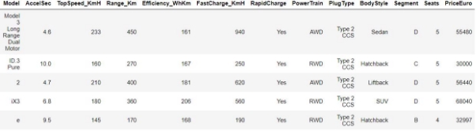
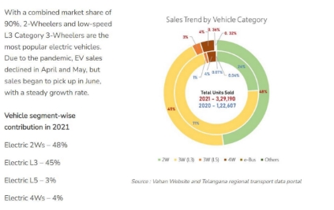

# MARKET SEGMENT ANALYSIS OF ELECTRIC VEHICLE MARKET IN INDIA

## BACKGROUND

**In 1996**, The first electric vehicle i.e. Three-Wheeler VIKRAM SAFA was developed by Scooters India Pvt Ltd, Lucknow and approximately 400 vehicles were made and sold. These vehicles ran on 72-volt lead acid battery.

**In  1999**, Mahindra  and  Mahindra Ltd. Launched its first  electric  three-wheeler  and  also  launched a new company, based  in Coimbatore, in 2001, to make  and sell electric vehicles named  Bijlee.  In  2004,  MEML  was  closed  down  due  to  lack  of  demand

**In  2000**, BHEL  developed  an  eighteen-seater electric bus. Its

power pack consisted of an AC Induction Motor and 96V Lead acid battery pack. Some 200 electric vans were built and run in Delhi, with monetary support from MNES. The major concern with these vehicles was their poor consistency, low life and high cost.

**In 2001**, Bajaj Auto ltd, Pune, had also demonstrated their 3-seater electric rickshaw. The vehicle used advance PMSM drive system. However, this product has not been commercially launched.

**In 2001**, REVA, Bangalore, entered the EV sector in the car industry with a vehicle developed by American company (Amerigon). Some 3200 cars had been sold worldwide including approximately 1500 cars that had been sold in India, mostly in Bangalore city.

**In 2007,** in two-wheeler segment, Hero cycles collaborated with UK based ULTRA Motor to launch a series of bikes. Other companies such as Electrothermal India, TVS Motor, Hero electric etc. are also manufacturing and selling their products. TATA Motors, Maruti Suzuki, Toyota and many other companies started entering Indian market with battery and hybrid electric vehicle products.

A major development that the Indian EV market will witness in 2022 is the entry of several new vehicle models and manufacturers in the two- and three-wheeler categories. These two make up for the majority of the current as well as near-future EV requirements in India and come with detachable batteries.

---

## MARKET OVERVIEW

The Indian electric vehicle market was valued at USD 1,434.04 billion in 2022, and it is expected to reach USD 15,397.19 billion by 2027, registering a CAGR of 47.09% during the forecast period (2022-2027).

The COVID-19 pandemic had limited domestically produced electric vehicles due to the shutdown of manufacturing facilities and lockdowns. However, as restrictions eased, EV witnessed optimistic growth as consumers became inclined toward affordable eco-friendly transportation supported by governments incentives.

The automotive sector in India is dominated by two-wheelers (scooters, motorbikes) and three- wheelers (autos and rickshaws) that play a significant role in last-mile mobility in the country. Rising government emphasis and focus on private and government players partnership to enhance EV ecosystem in the country. Increasing investments and product launches by major OEMs into the country and their focus on localizing supply chain facilities are expected to create a positive outlook in the market.

Moreover, in India, the level of market maturity also varies according to the state depending on factors, including demographics, income levels, regulatory landscape, and urbanization. For instance, the state of Uttar Pradesh, with one of the lowest urbanization rates, has seen significant uptake of electric two-wheelers. Maharashtra, on the other hand, with a higher urbanization rate, has the highest penetration of electric three-wheelers and passenger cars. Delhi is home to the largest electric commercial vehicle fleet due to a higher demand for electric buses and trucks.

---

## INDIAN GOVERNMENT INITIATIVE

Considering  all  above  aspects  Indian  government  has  taken  an  initiative  &  declare  the National Mission for Electric Mobility (NMEM2022). The National Mission for Electric Mobility (NMEM) has its two interrelated key objectives:

1. National energy security
1. Growth of domestic manufacturing capabilities in full range of electric vehicle technologies.

In January 2012, the ministry of heavy industries unveiled its ambitious draft action plan for Electric Mobility 2020, which targets almost six to seven million vehicles on the road by 2022. With  vision  to  encourage  reliable,  affordable  and  efficient  XEVs  (all  type  of  electrical vehicles) that meet consumer performance and price expectations through Government  - Industry  collaboration  for  promotion  and  development  of  indigenous  manufacturing capabilities, required infrastructure, consumer awareness and technology.

Thereby helping India to emerge as a leader in the XEV two-wheeler and four-wheeler market in  the  world  by  2022,  with  total  XEV  sales  of  6-7  million  units  thus  enabling  Indian automotive  Industry  to  achieve  global  XEV  manufacturing  leadership  and  contributing towards National fuel security with target of 400,000 passenger battery electric cars (BEVs) by 2022.avoiding 120 million barrels of oil and 4 million tons of CO2 which will lower vehicle emissions by 1.3 percent by 2022.

The total investment required is INR 20,000-23,000 Cr. There is a slow progress as such till now, however, after the announcement of FAME (Faster Adoption and Manufacturing of Hybrid and Electric Vehicles), there is little push. Linking FAME India and Make in India there is hope that there will be the faster adoption of EV in India as it is a need of an hour.**

---

## CHALLENGES  AND  OPPORTUNITIES  OF  ELECTRIC  VEHICLES  IN  THE FOLLOWING FIELDS

**Economic:**

The economic challenge is a major challenge of EV in India. In the developing nation EV adoption and large market growth is difficult. Economic challenges have different aspects.

1)**Electric Vehicles:**

Although gasoline and diesel are costly than electricity due to their high initial investment of EV, the price are more Since the systems of EV is not matured enough and most of the assembly process are to be done manually, mass production of the expensive parts of EV are still not economically justified, causing the selling price to be expensive in order for the company to maintain a healthy profit margin Indian population consist of middle class people and the people may find difficult in high initial investment.

2)**Battery:**

The materials used in constructing the batteries in EV have to maintain certain quality and it results high-cost High performance battery is produced but cost also becomes higher. The lithium-ion (Li-ion) batteries used in EVs present a very concerning. It has been reported that the extraction of cobalt, the essential component of the rechargeable Li-ion batteries, is linked to child labor with laws and policies introduced to improve the standards of ethical mining, the supply of the mineral will reduce while the demand stays high, resulting in further increase of the price of cobalt Li and Ouyang show that by reducing the battery costs of EV, it would help to decrease the total expenditure of consumers and allow them to afford higher charging price for the battery.

3)**Infrastructure:**

Infrastructure for charging is necessary and is categorized as public, semi public and private charging infrastructure which are public, semi-public and private charging infrastructure. Public charging infrastructure is open to the public and can usually be found at public parking area while semi-public charging infrastructure is only accessible by a certain group of people. Private  charging  infrastructure  refers  to  the  one  that  is  installed  in  a  private  garage  or household.**

---

## COMPARISON BETWEEN ELECTRIC VEHICLE VS FUEL VEHICLE

As the growing pollution has become a serious concern, **electric cars** are quite a relief. And, according to the research electric cars are better for the environment. Whereas, the fuel vehicle emits harmful gases like carbon due to petrol or diesel. But electric vehicles produce fewer greenhouse gases and air pollution than petrol. That's why interest in purchasing an electric vehicle is increasing. It is important to know how electric vehicles impact nature. As per the research by the European Energy Agency, the carbon emissions of an **electric car** are around 17-30% lower than driving a petrol or diesel car. When low carbon electricity is used, the emissions from electricity generation improve. Currently, there are 8 electric cars on sale in India. Of these, the Storm Motors R3 is the cheapest EV while the Jaguar I-Pace is the most expensive electric car in India. Upcoming electric cars in India include BMW i3, Mahindra XUV300 Electric and Tesla Model 3 are the upcoming models.

**Cars**:

- Chevy Bolt.
- Honda Clarity.
- Tesla Model S.
- Tesla Model X.
- BMW i3.
- Volkswagen e-Golf.

**Two wheelers**:

- Mahindra Gusto Electric
- Tunwal Mini Lithino 48V
- Ather 450X
- Bajaj Chetak
- Revolt RV400
- Triumph Street Triple

---

## Factors for purchasing electric cars:

Energy saving is the one reason people consider when shifting to **electric vehicle in India**. Though, there are several factors' people should consider while purchasing is the cost of fuel and maintenance and the overall purchase price of the vehicle as per the **electric vehicle market in India.** However, electric cars tend to be more expensive and these vehicles are becoming more common with a variety of model options to choose from. Also, your location is one of the factors for the cost of purchasing and operating the new vehicle along with brand name and type. One more factor that is considered to get the difference between electric and conventional vehicles is how fast and quick a vehicle takes you between two boardings and destination. Where electric vehicles generate more energy that drives cars faster.

The  basic  difference  between **electric  vehicles** that  also  called  EV  and  fuel  which  is categorized as Standard Internal Combustion Engine Models or ICE is that gasoline used by fuel vehicles and electricity required for electric vehicles. Mile per Gallon or MPG is the concept used to measure the fuel efficiency of ICE vehicles. However, the price of gas or fuel varies from time to time. And, fuel vehicles need to be filled up about every 250-300 miles of the journey. There are a variety of sources available for Electric vehicles to be powered by electricity. The electricity is produced by the burning gas or coal, or from renewable sources.

---

## Market Trends

### Growing Adoption of Electric Buses

The government of India has undertaken multiple initiatives to promote the manufacturing and adoption  of  electric  vehicles  in  India  to  reduce  emissions  pertaining  to  international conventions and develop e-mobility in the wake of rapid urbanization.

- The National Electric Mobility Mission Plan (NEMMP) and Faster Adoption and Manufacturing of Hybrid & Electric Vehicles in India (FAME I and II) helped create the initial interest and exposure for electric mobility. For instance, in phase two of FAME, the government announced an outlay of USD 1.4 billion through 2022. This phase focuses on the electrification of public and shared transportation through subsidizing  7,090  e-buses,  500,000  electric  three-wheelers,  550,000  electric passenger vehicles, and 1,000,000 electric two-wheelers.

To promote the domestic electric vehicle industry, the Indian government has provided tax exemptions  and  subsidies  to  EV  manufacturers  and  consumers.  As  per  the  phased manufacturing proposal, the government has imposed a 15% customs duty on parts that are used to manufacture electric vehicles and 10% on imported lithium-ion cells. The revised duty under PMP has been proposed from April 2021.

States have also launched policies that support powertrain electrification by stimulating the demand,  local  manufacturing,  research  and  development  (R&D),  and  infrastructure development. Several states, like Delhi, Kerala, Karnataka, Telangana, and Andhra Pradesh, have formulated their electric vehicle policies, while others are in the process of doing so. For instance,

- According to the Delhi Electric Vehicle Policy 2020, the government plans to have at least 50% e-buses for all new stage carriage buses and aims for 25% of the new vehicles to be electric by 2024. In March 2021, the Delhi government announced its plans to introduce an interest subvention of up to 5% for electric vehicle (EV) purchases  in  the  state.  This  initiative  has  been  taken  to  promote  the  Delhi government's EV policy offering financial incentives on all categories of e-vehicles, i.e.,  two-wheelers,  three-wheelers,  four-wheelers,  goods  carriers,  and  electric rickshaws.
- In February 2021, the Delhi government announced a subsidy of INR 30,000 for promoting e-rickshaws as last-mile connectivity in Delhi. This, in turn, has led to the proliferation in their demand in the city, further benefiting the market.

Owing to the above-mentioned instances and developments, rising government initiatives are expected to enhance demand in the market over the forecast period.

### Electric Two-wheeler Vehicles Expected to have Optimistic Growth

Though  the  COVID-19  pandemic  resulted  in  lockdowns  and  supply  chain  disruptions, increasing petrol and diesel prices, government incentives, and an increase in spending for setting up charging infrastructure in the country are expected to drive demand. For instance, In FY 2020, around 152,000 units of electric two-wheelers were sold in the country compared to 126,000 units sold in FY 2019.

In the electric two-wheeler segment, electric motorcycles and scooters are popular modes. Like conventional two-wheelers, they are easier to navigate through congested roads. From a speed point of view, low-speed (up to 25 km/hr.) and medium-speed electric two-wheelers (up to 40 kmph) with conventional lead-acid batteries are projected to dominate the market over the forecast period.

This is mainly because, in terms of upfront cost, they are already on par with ICE vehicles. However,  with  more  companies  becoming  eligible  for  FAME-II  incentives,  several  new models are expected to be operated in the market in the coming years. Some of the key two- wheeler rental companies have already started investing heavily in expanding their fleet of vehicles to cater to the rising demand in the country. For instance,

- In February 2021, Bounce, a bike rental startup in the country, made an announcement that it was planning to launch its electric scooter in the country. However, the expected launch date has not been declared. Price is expected to be around INR 55,000 and an additional INR 1,450 per month for maintenance, including battery maintenance.

Several local major players in the country are investing heavily to enhance their production capacity of electric two-wheelers in the country to cater to enhancing the demand in the country. For instance,

- In February 2021, Ampere Electric made an announcement that it would be investing INR 700 crore in setting up a new electric two-wheeler plant in Tamil Nadu. It is expected to have the potential to start manufacturing 100,000 units in its first year of operation.

Thus, with such growing advancements and developments passenger cars segment is expected to witness steady and consistent growth during the forecast period.

**PROBLEM STATEMENT:**

We are a team working under an Electric Vehicle Start-up. The Start-up is still deciding in which vehicle/customer space it will be develop its EVs.

We have to analyse the Electric Vehicle market in India using Segmentation analysis and come up with a feasible strategy to enter the market, targeting the segments most likely to use Electric vehicles.

By Using Fermin estimation, we have created some problem Statements:

- To understand the Indian Automobile Production and Sales. Comparison of EV vehicle gas vehicles and their sells.
- To identify the opportunities and challenges of using electric vehicles in India.
- Efficiency vs cost favoured towards EV or Fuel Vehicles.
- Investment to put forward to build Charging Station
- Propaganda required to move car users toward EV
- Unique types of EV need to be built for sustenance of company.
- EV battery cost required to produce in India.
- Feasibility of free Solar stations in India and Projection of sales of EV up to 10 years
- EV Cars price prediction and state wise distribution
- To Predict the electric Vehicles sales analysis in India

**DATA COLLECTION:**

Data was scraped from the website following websites. in data collection, just put we collected data from  data.world

finance.yahoo

kaggle.com

Some screenshots of the Data.

The above dataset we are used for this EV market segmentation analysis.

**DATA PRE-PROCESSING:** (Steps and libraries used)

Importing Libraries: firstly, we will import the libraries for our model, which is part of data pre-processing.

import numpy as np

import pandas as pd

import seaborn as sns

import matplotlib. pyplot as plt %Matplotlib inline

- from sklearn.cluster import KMeans
- Numpy we have imported for the performing mathematics calculation
- Matplotlib is for plotting the graph, and pandas are for managing the dataset.
- Seaborn is for data visualization library, it is based on matplotlib.
- Scikit-learn  have  sklearn.cluster.KMeans  module  to  perform  K-Means  clustering. While computing cluster centers and value of inertia, the ;lp

**TARGET MARKET:**

The  target  market  of  Electric  Vehicle  Market  Segmentation  can  be  categorized  into Geographic, SocioDemographic, Behavioral, and Psychographic Segmentation.

**Behavioral  Segmentation:**  searches  directly  for  similarities  in  behavior  or  reported behavior.

Example: prior experiencewith the product, amount spent on the purchase,etc.

**Advantage:** uses the very behavior of interest is used as the basis of segment extraction. **Disadvantage:** not always readily available.

**Psychographic Segmentation:** grouped based on beliefs, interests, preferences, aspirations, or benefits sought when purchasing a product. Suitable for lifestyle segmentation. Involves many segmentation variables.

**Advantage:** generally more reflective of the underlying reasons for differences in consumer behavior.

**Disadvantage:** increased complexity of determining segment memberships for consumers.

**Socio-Demographic Segmentation:**  includes age, gender, income and education. Useful industries.

**Advantage:** segment membership can easily be determined for every customer.

**Disadvantage:** if this criteria is not the cause for customers product preferences then it does not provide sufficient market insight for optimal segmentation decisions.

---

## Segmenting for Electric Vehicle Market

The market segmentation approach aims at defining actionable, manageable, homogenous subgroups of individual customers to whom the marketers can target with a similar set of marketing strategies. In practice, there are two ways of segmenting the market-a-priori and post-hoc.  An  a-priori  approach  utilizes  predefined  characteristics  such  as  age,  gender, income, education, etc. to predefine the segments followed by profiling based on a host of measured  variables  *(behavioral,  psychographic  or  benefit)*.  In the post-hoc approach to segmentation on other hand, the segments are identified based on the relationship among the multiple measured variables. The commonality between both approaches lies in the fact that the measured variables determine the *'segmentation theme'*. The present study utilizes an a- priori approach to segmentation so as to divide the potential EV customers into sub-groups.

It is argued that the blended approach of *psychographic* and *socioeconomic attributes* for market segmentation enables the formulation of sub-market strategies which in turn satisfy the specific tastes and preferences of the consumer groups. Straughan and Roberts presented a comparison  between  the  usefulness  of  *psychographic,  demographic,  and  economic* characteristics based on consumer evaluation for eco-friendly production

They pinpointed the perceived superiority of the psychographic characteristics over the socio- demographic and economic ones in explaining the environmentally-conscious consumer behavior and thus, the study recommended the use of psychographic characteristics in profiling the consumer segments in the market for eco-friendly products. The present study adds perceived- benefit  characteristics  guided by  blended  psychographic  and  socio-economic  aspects  for segmenting the consumer market.

**EXPLORATORY DATA ANALYSIS:**

We start the Exploratory Data Analysis with some data Analysis drawn from the data without Principal Component Analysis and with some Principal Component Analysis in the dataset obtained from the combination of all the data we have.  PCA is a statistical process that converts the observations of correlated features into a set of linearly uncorrelated features with the help of orthogonal transformation. These new transformed features are called the Principal Components.  The process helps in reducing dimensions of the data to make the process of classification/regression or any form of machine learning, cost-effective**

Importing data set in python df= pd.read\_csv(data.csv')

see first five Rows in the dataset

**Finding out the number of null values**

There are no missing values in the dataset hence there is no requirement of any imputation technique.

**Descriptive statistics:**

Above table consists of five number summary the dataset which is, median, 25%, median, 75%, minimum, maximum.

**Pair plot of all the columns based on Rapid Charger presence:**

Pair plot is used to plot multiple pairwise bivariate distributions in a dataset.

**Heatmap to show the correlation of the data**

**Correlation Matrix:** A correlation matrix is simply a table that displays the correlation. It is best used in variables that demonstrate a linear relationship between each other. Coefficients for different variables. The matrix depicts the correlation between all the possible pairs of values through the heatmap in the below figure.  The relationship between two variables is usually considered strong when their correlation coefficient value is larger than 0.7

**Frequency of the Brands in the dataset:**

Byton, Fiat and smart are the prominent brands and Polestar being the least **Top speeds achieved by the cars of a brand:**

Porsche, Lucid and Tesla produce the fastest cars and smart the lowest. **Range a car can achieve:**

**Car efficiency**

Byton, Jaguar and Audi are the most efficient and Lightyear the least **Number of seats in each car:**

Mercedes, Tesla and Nissan have the highest number of seats and Smart the lowest **Price of cars (in Euro)**

Lightyear, Porsche and Lucid are the most expensive and SEAT and Smart the least **Type of Plug used for charging:**

Most companies use Type 2 CCS and Type 1 CHAdeMO the least. **Cars and their body style:**

Most cars are eiher SUV or Hatchback **Number of Seats:**

Majority of cars have 5 seats.

Volkswagen cars have highest speed among available cars followed by Mercedes and Nissan.

Polestar, Renault, Mercedes cars have highest Acceleration.

Distribution of cars:

**Brand and their range:**

**To see the Distribution:**

**state wise distribution of electrical Vehicles:**

Number of Electric Vehicle Charging Sanctioned

350 300 250 200 150 100 50 Sanctioned 0

Number of Electric Vehicle Charging

State

**Correlation matrix plot for loadings:**

**Scree  Plot:**  is a common method for determining the number of PCs to be retained  via graphical representation. It is a simple line segment plot that shows the eigenvalues for each individual PC. It shows the eigenvalues on the y-axis and the number of factors on the x- axis. It always displays a downward curve. Most scree plots look broadly similar in shape, starting high on the left, falling rather quickly, and then flattening out at some point. This is because  the  first  component  usually  explains  much  of  the  variability,  the  next  few components explain a moderate amount, and the latter components only explain a small fraction of the overall variability. The scree plot criterion looks for the “elbow” in the curve and selects all components just before the line flattens out. The proportion of variance plot: The selected PCs should be able to describe at least 80% of the vehicles.

**Extracting Segments: Dendrogram**

This  technique  is  specific  to  the  agglomerative  hierarchical  method  of  clustering.  The agglomerative hierarchical method of clustering starts by considering each point as a separate cluster and starts joining points to clusters in a hierarchical fashion based on their distances. To  get  the  optimal  number  of  clusters  for  hierarchical  clustering,  we  make  use  of  a dendrogram which is a tree-like chart that shows the sequences of

merges or splits of clusters. If two clusters are merged, the dendrogram will join them in a graph and the height of the join will be the distance between those clusters.  As shown in Figure, we can chose the optimal number of clusters based on hierarchical structure of the dendrogram. As highlighted by other cluster validation metrics, four to five clusters can be considered for the agglomerative hierarchic

**Elbow Method:**
The Elbow method is a popular method for determining the optimal number of clusters. The method is based on calculating the Within-Cluster-Sum of Squared Errors (WSS) for a different number of clusters (k) and selecting the k for which change in WSS first starts to diminish. The idea behind the elbow method is that the explained variation changes rapidly for a small number of clusters and then it slows down leading to an elbow formation in the curve. The elbow point is the number of clusters we can use for our clustering algorithm.
The  KElbowVisualizer  function  fits  the  KMeans  model  for  a  range  of  clusters  values between 2 to 8. As shown in Figure, the elbow point is achieved which is highlighted by the function itself. The function also informs us about how much time was needed to plot models for various numbers of clusters through the green line. Evaluating the cluters using Distortion as follows:

**Evaluating the clusters using silhouette**

**Evaluating the cluters using calinskiharabas**

**Analysis and Approaches used for Segmentation Clustering**

**Clustering** is one of the most common exploratory data analysis techniques used to get an intuition about the structure of the data. It can be defined as the task of identifying subgroups in the data such that data points in the same subgroup (cluster) are very similar while data points in different clusters are very different. In other words, we try to find homogeneous subgroups within the data such that data points in each cluster are as similar as possible according to a similarity measure such as euclidean-based distance or correlation-based distance.

The decision of which similarity measure to use is application-specific. Clustering analysis can be done on the basis of features where we try to find subgroups of samples based on features or on the basis of samples where we try to find subgroups of features based on samples.

**K-Means Algorithm**

**K  Means  algorithm** is an iterative algorithm that tries to partition the dataset into pre- defined distinct non-overlapping subgroups (clusters) where each data point belongs to **only one  group**.  It tries to make the intra-cluster data points as similar as possible while also keeping the clusters as different (far) as possible. It assigns data points to a cluster such that the sum of the squared distance between the data points and the cluster's centroid (arithmetic mean of all the data points that belong to that cluster) is at the minimum. The less variation we have within clusters, the more homogeneous (similar) the data points are within the same cluster The way k means algorithm works is as follows:

- Specify number of clusters K.
- Initialize centroids by first shuffling the dataset and then randomly selecting K data points for the centroids without replacement.
- Keep iterating until there is no change to the centroids. i.e assignment of data points to clusters isn't changing.

The approach k-means follows to solve the problem is **expectation  maximization** The E-step is assigning the data points to the closest cluster. The M-step is computing the centroid of each cluster. Below is a break down of how we can solve it mathematically,

The objective function is:

(1)  And M-step is :

J

Uk = 2∑im=1wik(xi-uk) = 0

∑m w xi u = i=1 ik

k ∑m w

i=1 ik

K means algorithm is very popular and used in a variety of applications such as market segmentation, document clustering, image segmentation and image compression, etc.

The goal usually when we undergoa cluster analysisis either:

1. Get a meaningful intuition of the structure of the data we're dealing with.
1. Cluster-then-predict where different models will be built for different subgroups if we believe there is a wide variation in the behaviors of different subgroups.

The **k-means clustering algorithm** performs the following tasks:

- Specify number of clusters K
- Initialize centroids by first shuffling the dataset and then randomly selecting K data points for the centroids without replacement.
- Computethe sum of the squared distance betweendata points and all centroids.
- Assign each data point to the closest cluster (centroid).
- Compute the centroids for the clusters by taking the average of the all data points that belong to each cluster. 
- Keep iterating until there is no change to the centroids. i.e assignment of data points to clusters isn't changing.

According to the Elbow method, here we take K=4 clusters to train KMeans model. The derived clusters are shown in the following figure

**Prediction of Prices most used cars**

Linear regression is a machine learning algorithm based on supervised learning. It performs a regression task. Regression models targets prediction value based on independent variables. It is mostly used for finding out the relationship between variables and forecasting. Here we use a linear regression model to predict the prices of different Electric cars in different companies. X contains the independent variables and y is the dependent Prices that is to be predicted. We train our model with a splitting of data into a 4:6 ratio, i.e. 40% of the data is used to train the model.

**LinearRegression().fit(Xtrain,ytrain)** command is used to fit the data set into model. The values of intercept, coefficient, and cumulative distribution function (CDF) are described in the figure.

After completion of training the model process, we test the remaining 60% of data on the model. The obtained results are checked using a scatter plot between predicted values and the original test data set for the dependent variable and acquired similar to a straight line as shown in the figure and the density function is also normally distribute

The metrics of the algorithm, Mean absolute error, Mean squared error and mean square root error are described in the below figure:

**Profiling and Describing the Segments**

Sorting the Top Speeds and Maximum Range in accordance to the Price with head () we can view the Pie Chart.

**Pie Chart:**

**Target Segments:**

So from the analysis we can see that the optimum targeted segment should be belonging to the following categories:

**Behavioral:** Mostly from our analysis there are cars with 5 seats. Demographic:

- Top Speed & *R*ange: With a large area of market the cost is dependent on Top speeds and Maximum range of cars.
- Efficiency*:* Mostly the segments are with most efficiency.

Psychographic:

- Price: From the above analysis, the price range is between 16,00,000 to 1,80,00,000.

Finally, our target segment should contain cars with most **Efficiency**, contains **Top Speed** and price between **16 to 180 lakhs** with mostly with **5 seats**.

**Customizing the Marketing Mix**

The marketing mix refers to the set of actions, or tactics, that a company uses to promote its brand or product in the market. The 4Ps make up a typical marketing mix

-Price, Product, Promotion and Place.

- **rice:** refers to the value that is put for a product. It depends on segment targeted, ability of the companies to pay, ability of

customers to pay supply - demand and a host of other direct and indirect factors. • **Product:** refers to the product actually being sold - In this case, the service. The product must deliver a minimum level of performance; otherwise even the best work on the other elements of the marketing mix won't do any good. • **Place:** refers to the point of sale. In every industry, catching the eye of the consumer and making it easy for her to buy it is the

main aim of a good distribution or 'place' strategy.  Retailers pay a premium for the right location.  In fact, the mantra of a successful retail business is 'location, location, location'.

- **Promotion:**  this refers to all the activities undertaken to make  the  product or service known to the user and trade.

This can include advertising, word of mouth, press reports,

incentives, commissions and awards to the trade. It can also include consumer schemes, direct marketing, contests and prizes.

All the elements of the marketing mix influence each other. They make up the business plan for a company and handle it right, and can give it great success. The marketing mix needs a lot of understanding, market research and consultation with several peo- ple, from users to trade to manufacturing and several others.

**Electronic vehicle Sales in India:**

The overall EV sales in April 2022 bounced back to their growth trajectory, clocking 73,046 units. This signifies a month-on-month decrease of 5.3%, but a year-on-year leap of 415%.

**Registered EV Sales Trend in India (April 2021-April 2022)**

*.*As depicted in the figure below, EV registrations in April 2022 were driven by electric two-wheelers and passenger-type electric three-wheelers, which together accounted for 92.92% of total registrations in the month. The shares of these categories were followed by E-Cars (3.64%), cargo-type electric three-wheelers (3.17%), and so on.

**Category-wise EV Sales**:

Among all the states and UTs, Uttar Pradesh retained its top spot in EV share with 16% of overall sales, followed by Karnataka with 13% share. Maharashtra fell to the third spot with an 11% share, followed by Gujarat (10%), Tamil Nadu (8%), Rajasthan (7%), and Delhi (5%).

**Region-wise Registered EV Sales (State/ UT) - 2021:**

**Region-wise Registered EV Sales (State/ UT)- April 2022:**

**High**

**Speed electric Two-Wheeler (HS-E2W):**

The overall HS-E2W sales in the country in April 2022 stood at 49,141 units, signifying a slight decline of 0.91% month-on-month, but a whopping 866% Year- on-year leap in registrations. The Top 10 players, as shown below, accounted for 93% of the total registrations witnessed in April 2022.Ola Electric moved to 1st position this month from the previous month's number 2nd position. Further, Hero Electric fell to the third position, with Okinawa taking second place. Bajaj re- entered the Top 10 race after its brief absence last year, pushing Benling to 11th place.

**High-Speed E2W Sales Trend:**

**Top High-Speed E2W Players in April 2022:**

**Electric Three-Wheeler (E3W)**

The sales of registered E3Ws passenger and cargo-type in April 2022 stood at 18,738 units and 2,316 units respectively, signifying a month-on-month decrease of 9.59% for E3W - Passenger and a month-on-month decrease of 26.38% for E3W - Cargo.

Sales Trend of E3W - Passenger (Left) and E3W - Cargo (Right)

The cumulative sales of the top 7 electric 3-wheeler players across passenger and cargo segments in April 2022 accounted for a 38.4% share of the entire E3W market. YC Electric Vehicle continued to have the highest share of 8.95%, which was  followed  by  Mahindra  Electric  Mobility  (8.94%),  Saera  Electric  Auto (5.56%),  Champion  Poly  Plast  (4.37%),  Dilli  Electric  (3.88%),  Best  Way Agencies (3.4%), and Unique International (3.3%).

**Top E3W Players in April 2022**

**Electric Cars Sales Trend**

The cumulative sales of E-cars in April 2022 stood at 2,659 units, witnessing a month-on-month  fall  of  25.55%  but  a  Year-on-year  surge  of  344.65%  in registrations. Tata Motors has been driving E-car sales the entire year. This month, the Company accounted for 87% of the total registrations. Sales of E-cars by BYD, Audi, and BMW witnessed the pace picking up this month.

**Player-wise E-Car Sales Trend:**

The cumulative sales of E-buses in April 2022 stood at 164 units, with a month- on-month rise of 116% and a Year-on-year increase of 6%. This month's sales were driven by JBM Auto (30%), followed by PMI Electro (29%), Tata Motors (23%), and Olectra Greentech (18%).Player-wise E-Bus Sales Trend

**Reverse Engineering Electric Vehicle Battery Chemistry to predict its Price**

The purpose of this module is to predict how the EV battery price will fluctuate. This way, the start-up's business plan can maneuver according to predictions. Emulating Tesla's business model to successively reduce the price of their cars.

**First Principle Analysis**

A typical Lithium-Ion battery contains

- Cobalt
- Nickel
- Lithium
- Carbon
- Separation Polymer (Fancy name for Electrolyte)
- Seal Can

**Data Source**

To get a quantized dataset for each rare earth metal mentioned above and their price, the companies holding rights to sell this data, demand a high price. A startup with no funding would have to cleverly find a maneuver. So, I will use the TESLA stock price, and associate each stock value with the proportional value of the mineral.

The Source of TESLA stock price is[finance.yahoo.com.](https://finance.yahoo.com/)

**Battery Chemistry**

Weight of Tesla Battery = 500kg

here use NCA (Nickel Cobalt Aluminum-Oxide) Weight of Seal Can   = 200kg (40%) Weight of Aluminum  = 100kg (20%) Weight of Cobalt  = 028kg (14%) Weight of Nickel  = 150kg (75%) Weight of Lithium   = 022kg (11%)

**Cost Per Mineral**

Avg Car = 2000kg (Tesla Model S has be taken for reference)

Battery = 0500kg

Battery = 25% of Car -- (1)

Tesla Car Price = $100,000 (Tesla Model S) Average Tesla Share Price (2022) = $1,000 Which tells us, Tesla Car = 100 Tesla Shares

Thus,

Battery = $25,000 or 25 Tesla Shares

From previous metrics of Battery Chemistry,

Seal Can  = 10.00 Shares Aluminum   = 05.00 Shares Cobalt   = 03.50 Shares Nickel   = 18.75 Shares Lithium  = 02.75 Shares

**Predicting Tesla Share price using LSTM**

Predicting share price for an unknown time is redundant. So, intentionally we will predict known values and use the mean square error to attenuate the network.Long Short Term Memory is best for this application. Since the data is sequential, it could emulate the behavior of a string.

This is our known stock fluctuation. This data is split into test and train. The Train data will be the data from the beginning upto 2020.

The Test data will be the data from 2020 upto the middle of 2022.

The training is done using the  adam  optimizer and  mean\_squared\_error .

The model will follow a batch size of 1, with 10 epochs.

**Prediction**

After training the model. We can predict future values using the test dataset. Not every point will be valid, so here is how the model fared.

The yellow points are where the model was 100% accurate. The blue points are the training set.

The green points are testing data, which later during mse calculation, is funneled into the model.

We can use simple calculation from the Battery Chemisty discussed earlier.

Cobalt   = Prediction \* 3.5 Nickel = Prediction \* 18.75 Lithium  = Prediction \* 2.75

**Future of electric vehicle in India:**

A nationalized mission in the year 2019, started which focuses on the research and development of battery technology** to decrease the dependence on China. With this, the government is also inviting foreign players to explore the Indian market, such as Tesla, etc.**

These steps are competitive, but to make a fruitful transition to EV, there's an urge to focus on the following Focus Areas

- Charging Infrastructure
- R&D in Battery Tech
- Scour for essential metals
- Make in India EVs
- EV education

India has only 300 charging stations; However, India has **aimed to have 2900 charging stations by the year 2023**. The work of the Indian government has started and we need more **PPP (Public-Private Partnership)** collaboration to achieve this target. Battery technology is really important. The Indian government has not been very forthcoming about **electric vehicle education**.[ EV courses ](https://edifypath.com/page/electric-vehicles)need to be introduced into the school curriculum.  Bachelors  and  vocational  curriculum  have  to  be  devised  to  solve  the technology and skilled labour crisis. Another grave challenge would be how well the existing automobile industry can transit towards EV segments.

**REFERENCES:**

1. [Modor Intelligence](https://www.mordorintelligence.com/industry-reports/india-electric-vehicle-market)
2. [Research Gate](https://www.researchgate.net/figure/Electric-vehicle-market-segment-in-India_fig1_352994590)
3. [Research Gate](https://www.researchgate.net/publication/322383600_Indian_Market_Analysis_and_Sales_Strategy_for_potential_Sports_Electric_Vehicle_Segment?enrichId=rgreq-7bec7f62f6b8bd75875fd626c6167b28-XXX&enrichSource=Y292ZXJQYWdlOzMyMjM4MzYwMDtBUzo2MTMwODcxMzY3MjI5NDRAMTUyMzE4Mjc3MjM2NQ%3D%3D&el=1_x_3&_esc=publicationCoverPdf)
4. [River Publishers](https://www.riverpublishers.com/journal_read_html_article.php?j=JGE/8/1/3)
5. [IBEF](https://www.ibef.org/blogs/electric-vehicles-market-in-india)
6. [Dive](https://www.diva-portal.org/smash/get/diva2:998548/FULLTEXT01.pdf)
7.  [India ESA](https://indiaesa.info/media/downloadfiles/EV_Report_Brochure._234429529.pdf)
8. [Research Gate](https://www.researchgate.net/publication/322383600_Indian_Market_Analysis_and_Sales_Strategy_for_potential_Sports_Electric_Vehicle_Segment)
